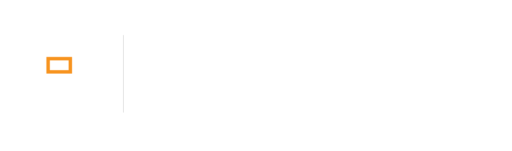

<!-- Drop logo-dark.png and logo-light.png into assets/ and uncomment.
<div align="center">
    <picture>
        <source media="(prefers-color-scheme: dark)" srcset="assets/logo-dark.png">
        <source media="(prefers-color-scheme: light)" srcset="assets/logo-light.png">
        
    </picture>
</div>
-->

<div align="center">

# 操り2D · Ayatsuri2D

[](LICENSE)
[](https://www.rust-lang.org/)
[](docs/integration.md)
[](docs/format.md)
[](#status)

_Real-time 2D puppet animation and rigging. A cross-platform open alternative to Live2D Cubism, with full end to end moc3 support._

</div>

---

`操り` (_ayatsuri_) is the working of a puppet: the strings, the hands, the craft
of making a jointed figure move as though it were alive. It is what the software
does, and what a rigger does.

## What it does

Layered artwork is deformed by parameter values sixty times a second, so a
drawing turns its head, blinks, and its hair swings. A runtime does the moving;
an editor does the rigging.

The runtime is the product, and **the C ABI is how it reaches anything**. Unity,
Unreal, Godot, Python, JavaScript, or a C or C++ engine of your own: if it can
call C, it can drive a puppet. The editor is how content gets into it.

That ABI is not a binding bolted on at the end. It is designed first and treated
as the load-bearing piece, because a runtime nothing can embed is a runtime
nobody uses. Every language binding holds an opaque handle and passes
primitives; none of them owns model state or allocates per frame, so a puppet
runs at the same speed from C as it does from Rust.

Models are saved as **`.aom`**, the Ayatsuri Open Model: a MessagePack payload
in the same container as Alterion's other formats, with bulk vertex and keyform
data kept as flat blobs so it can be read without copying. It is a superset of
`.moc3`, so everything moc3 can express round-trips back out, and everything
added on top does not.
Live2D models import, and PSD import is the migration path for riggers who want
the features moc3 cannot carry.

## Status

**Early.** The format research is done and verified; the code is being written.

```
moc3 format          mapped and verified across 5 models, 3 versions
openmoc3             compiles, section map present, parsing not implemented
runtime / editor     designed, not started
```

Nothing here is usable yet. The [documentation](docs/) is ahead of the code on
purpose: the decisions that are expensive to reverse were made first.

## Layout

```
crates/ayatsuri-format    the puppet format: types, versioning, serialisation
crates/ayatsuri-core      deformation, physics, masking, animation, draw order
                          no I/O, no renderer, no allocation after load
crates/ayatsuri-render    renderer behind a trait; backend not yet chosen
crates/ayatsuri-capi      the C ABI: ayatsuri.h, plus a static and shared lib
                          this is the load-bearing wall, see docs/integration.md
crates/ayatsuri-psd       PSD import
crates/openmoc3           standalone safe reader for Live2D .moc3 files
```

`ayatsuri-core` never depends on `openmoc3`. The moc3 parser is the
hostile-input surface and is kept isolated, and `openmoc3` is useful on its own
to people who will never adopt the rest of this.

## Why

Live2D Cubism is effectively the only option for this work, and:

- its editor runs on **Windows and macOS only**;
- its licence forbids using **your own exported files** with competing software;
- its runtime reads offsets out of model files and dereferences them **without
  bounds checking**, which is
  [CVE-2023-27566](https://undeleted.ronsor.com/live2d-a-security-trainwreck/):
  a `.moc3` is an arbitrary memory write, and VTuber models are routinely
  downloaded from strangers.

## Two goals, both testable

**Never crashes.** Every model is treated as hostile: bounds-checked before any
dereference, fuzzed in CI from a known-malicious corpus, and the runtime path
forbids panics by lint rather than by discipline.

**Never lags.** Not fast, _predictable_. A stream at a steady 45fps beats 60fps
that hitches every few seconds, because perception is tuned to the outliers.
Allocation happens at load, the frame loop allocates nothing, and benchmarks
assert p99.9 rather than the mean.

Both are enforced as build failures. See [`docs/goals.md`](docs/goals.md).

## Using it from C

```c
#include <ayatsuri.h>

ay2d_model *m = ay2d_load(bytes, len);      /* validates; NULL on bad input  */
ay2d_set_params(m, ids, values, n);         /* arrays in, never per-object   */
ay2d_update(m, dt);
ay2d_drawables(m, &out);                    /* or keep it on the GPU         */
```

Coarse by design. A chatty ABI that costs one call per parameter would be 6000
calls a second before anything is drawn, and every binding in every language
would pay for it.

## Documentation

```
docs/goals.md           what the project guarantees, and how those are tested
docs/architecture.md    the crates, how they depend, and the C ABI
docs/format.md          the puppet format, and moc3 compatibility
docs/physics.md         how hair, cloth and accessories move
docs/integration.md     embedding the runtime, and the plugin protocol
docs/provenance.md      where the format knowledge came from
```

## Licensing

Not uniform, deliberately. `openmoc3` is MIT so the work flows back to the
community it came from; the project generally is GPL-3.0. Whether the runtime
and C ABI should be permissive is still open, and it matters: a copyleft runtime
cannot be embedded in a proprietary game, which is most of what a puppet runtime
is for. See [`LICENSING.md`](LICENSING.md).

## Provenance

No Live2D software has been installed, no Live2D binary disassembled, and no
contributor has accepted a Live2D licence agreement. Format knowledge derives
from Live2D's own published specifications, permissively licensed community
work, and independent analysis of model files obtained under their creators'
terms. See [`docs/provenance.md`](docs/provenance.md).

Standing on the shoulders of
[Sakura Motion / PurismCore](https://github.com/SakuraMotion/PurismCore) and
[OpenL2D](https://github.com/OpenL2D/moc3ingbird), both of which corrected our
own findings more than once.

---

Live2D and Cubism are trademarks of Live2D Inc. This project is not affiliated
with, endorsed by, or supported by them. Please do not contact Live2D about it.
